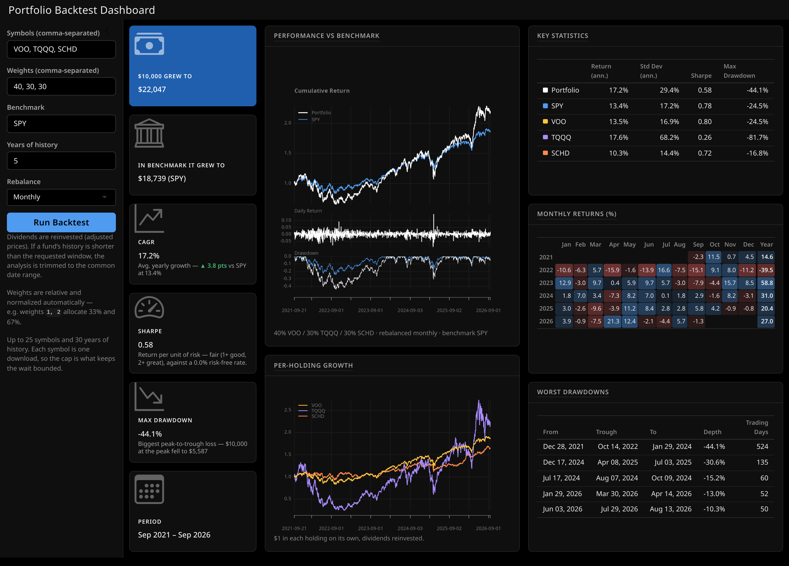

# Portfolio Backtest Dashboard

An interactive [Quarto](https://quarto.org) dashboard (R + Shiny) for backtesting
a portfolio of tickers against a benchmark, using dividend-adjusted prices from
Yahoo Finance.



## Features

- **Any tickers Yahoo knows** — equities, ETFs, crypto (`BTC-USD`), indexes
  (`^GSPC`), international listings. Up to 25 symbols and 30 years of history
  per run; each symbol costs one sequential download, so the caps are what keep
  the wait bounded. If a fund's history is shorter than the requested window,
  the analysis is trimmed to the common date range.
- **Free-scale weights** — weights are relative and normalized automatically:
  `1, 2` allocates ⅓ / ⅔, `40, 30, 30` works as percentages.
- **Rebalancing** — monthly, quarterly, yearly, or buy & hold.
- **Novice-friendly metric cards** — growth of $10,000 (portfolio and
  benchmark), CAGR with a benchmark comparison, Sharpe ratio with a
  plain-English verdict, max drawdown translated into dollars, all with
  short interpretive captions.
- **Stated assumptions** — the Sharpe ratio is computed against a 0% risk-free
  rate, which the card says on its face. It is return per unit of risk rather
  than *excess* return per unit of risk, so treat the "1+ good, 2+ great"
  bands as generous whenever cash is paying something.
- **Charts and tables** — performance vs benchmark, growth of $1 per holding
  (the seven largest positions when there are more, so every drawn line keeps a
  distinct colour), annualized key statistics, monthly-returns calendar,
  worst-drawdowns table. Both charts carry alt text built from the current
  backtest, and the row-colour chips are paired with the series name in text.
- **Calendar-true annualization** — CAGR/Sharpe/volatility use a continuous
  effective scale derived from the data's own observation frequency, so
  weekday markets (~252/yr), Sunday–Thursday exchanges, and 7-day crypto are
  all annualized correctly and stay consistent with the growth figures.

## Running

Requires [Quarto](https://quarto.org/docs/get-started/) and R with `shiny`,
`quantmod`, and `PerformanceAnalytics` installed (plus internet access for
Yahoo Finance downloads).

```bash
quarto preview portfolio_dashboard.qmd
```

Set your symbols, weights, benchmark, history window, and rebalancing
frequency in the sidebar, then click **Run Backtest**.

## Project layout

| Path | Purpose |
|------|---------|
| `portfolio_dashboard.qmd` | Dashboard layout and the thin Shiny layer |
| `portfolio_core.R` | Pure logic: parsing, validation, backtest math, table builders, colour system |
| `theme.scss` | Bootstrap/SCSS theme: surfaces, typography, value boxes, tables |
| `tests/` | testthat suite covering the core logic |

## Tests

The suite runs entirely on synthetic fixtures (no network needed) and covers
input validation messages, formatting regressions, and backtest accuracy
invariants such as CAGR-vs-growth consistency and sampling-grid invariance:

```bash
Rscript tests/run_tests.R
```

## Disclaimer

This is an educational backtesting toy. Past performance does not predict
future results, and nothing here is investment advice.
